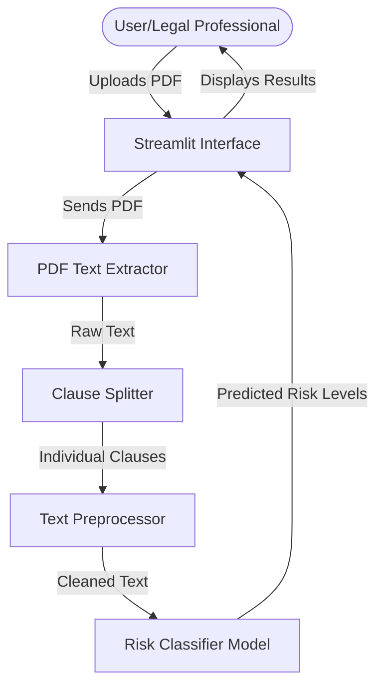
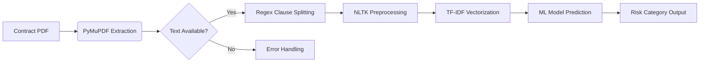
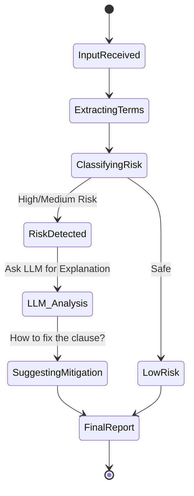
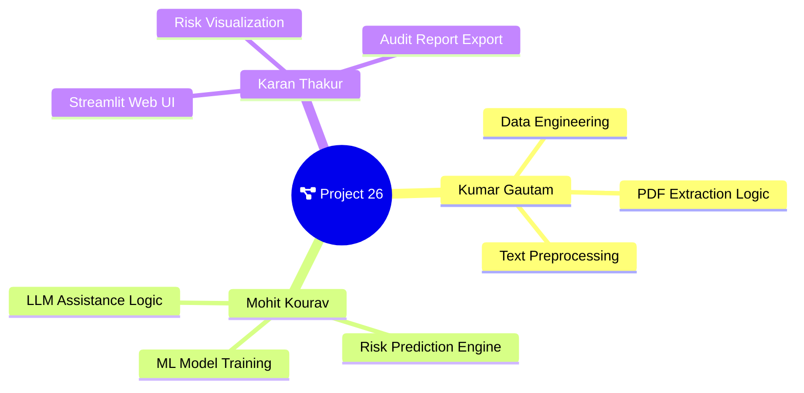

# Project Workflow & Architecture

This document describes the flow of information and processing steps in the Intelligent Contract Risk Analysis system using Mermaid diagrams.

## 1. High-Level System Architecture
This diagram shows how the user interacts with the system and how the background processes handle the data.

## 2. Milestone 1: Detailed Data Pipeline
This flow represents the work completed for the initial ML-based classification.

## 3. Milestone 2: Agentic Assistant Flow (Upcoming)
This shows how LangGraph and LLMs will interact for deeper legal reasoning.

## 4. Team Responsibilities & Work Division
This map outlines the specialized roles for Phase 1 and Phase 2.

## 5. System Themes & Styling
*All diagrams use the 'Base' modern theme with customized node coloring for readability.*
